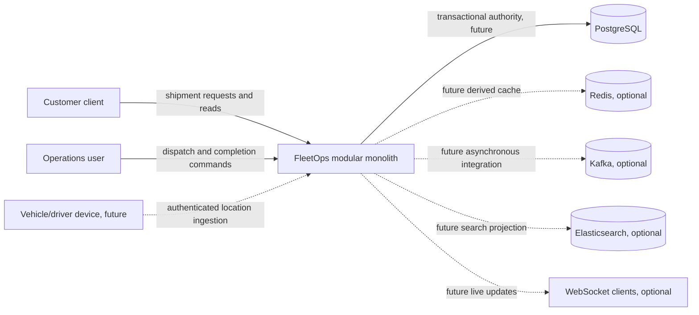
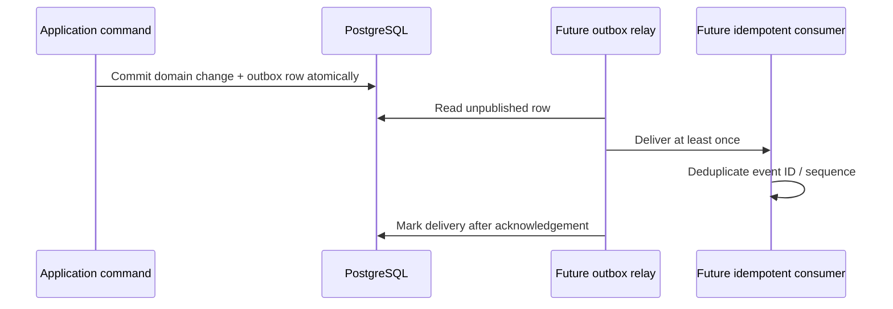

# System architecture (target direction)

## Current state

The repository contains a Java 21 Spring Boot Maven application foundation and a context-load test. It has no domain modules, HTTP API, database, authentication, integrations, or deployment infrastructure. Everything below is a target design for incremental implementation, not a claim about runtime behavior.

## Context

Dotted components and device input are future options, not dependencies or committed architecture. The first deployment can remain one process backed by PostgreSQL when the first persistence slice is implemented.

## Modular monolith responsibilities

Organize by business capability as it is implemented: customer/account identity, shipment lifecycle, dispatch/resources, and tracking. Do not create empty packages/modules solely to match this list. Within a capability, domain code owns invariants and state transitions; application code coordinates authorization context, transactions, and use cases; infrastructure adapts database/HTTP/provider details. Dependencies point inward: domain rules must not depend on Spring or persistence representations. Shared code should remain small and contain only stable cross-cutting primitives.

PostgreSQL will own committed customer, shipment, dispatch, resource, and tracking history state. Relational constraints and transactions provide authoritative coordination. Future technology has narrowly scoped possible responsibilities:

- Redis: disposable cache or latest-location acceleration only after profiling; loss/eviction cannot change business truth.
- Kafka: asynchronous integration/event distribution only after consumers and delivery needs exist; transactional outbox, at-least-once delivery, and idempotent consumers required.
- Elasticsearch: rebuildable search projection only if PostgreSQL search cannot meet measured needs; never authoritative.
- WebSocket: low-latency notification channel only; reconnecting clients recover from an authorized HTTP snapshot, and dropped messages do not lose committed state.

No future component is required by this initial design, and no new dependency is justified yet.

## Future event flow

The relay and broker do not exist. The flow is a future pattern if durable asynchronous side effects are introduced; it does not replace synchronous domain transactions.
