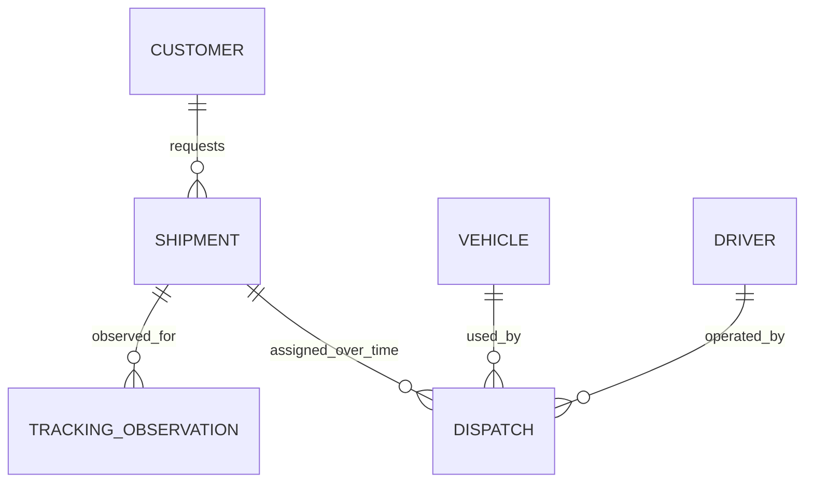

# Initial domain model (proposed)

This is a domain design, not an implementation. The repository currently has no business classes, schema, or API. Names and the minimum data below are provisional until operations and customer workflows are confirmed.

## Concepts and responsibility

| Concept | Exists independently? | Responsibility / owned information | Form and boundary |
|---|---|---|---|
| Customer | Yes, as an account identity | Identifies the party that requests and may view its shipments. Initially only stable identity and account status are justified; contacts, billing, CRM, and preferences are out of scope. | Customer aggregate root. Owns account status and identity. Other roots reference its ID. |
| Shipment | Yes | A customer's request to move goods: identity, customer reference, agreed pickup/delivery instructions and lifecycle data as those requirements are confirmed. | Shipment aggregate root; owns shipment lifecycle. Avoid guessed dimensions, pricing, addresses, or cargo fields until requirements establish them. |
| Fleet | No initial entity | A grouping/reporting concept, not a consistency boundary established by current requirements. | Omit. Revisit if fleets have distinct ownership, policy, or operational lifecycle. |
| Vehicle | Yes as an operational resource | Stable vehicle identity and dispatch eligibility/current assignment. Registration/maintenance/capacity details require confirmed operational needs. | Vehicle aggregate root; owns its availability and current assignment reference. |
| Driver | Yes as an operational resource | Stable driver identity and dispatch eligibility/current assignment. Employment, licensing, and personal data require requirements and access controls. | Driver aggregate root; owns availability and current assignment reference. |
| Dispatch | Yes | A commitment pairing one shipment, one vehicle, and one driver for an operation. | Dispatch aggregate root; owns assignment lifecycle. Cross-root rules are coordinated transactionally. |
| Delivery | Not initially independent | The outcome and evidence of carrying out a shipment. Avoid a second copy of shipment status. | Initially a Dispatch/Shipment lifecycle outcome, represented by shipment completion data or a small value object once proof requirements are known. Promote to aggregate only if it has its own lifecycle, actors, evidence, or correction workflow. |
| Tracking / Location | Yes as records, not a mutable shipment aggregate | Historical observations and a derived latest-position view. | Append-only tracking observation records; latest state is a rebuildable projection. Location is a value object. High volume may warrant a separate storage strategy after measurement. |

## Relationship sketch

The diagram shows references, not cascade ownership. Dispatch retains historical references to vehicle and driver identities; deleting referenced operational records would undermine auditability. Customer/shipment retention and deletion policy remains an open business/legal decision.

## Transaction, concurrency, and read patterns by concept

| Concept | Transaction / concurrency concern | Read pattern that justifies the concept |
|---|---|---|
| Customer | Create/disable in its own transaction. Shipment creation must validate that the account is active; if disable-versus-create ordering matters, lock or version the customer row in the creation transaction. | Resolve authenticated customer identity; list that customer's shipments. No CRM search assumed. |
| Shipment | Own create and single-root lifecycle changes; row lock/version serializes competing commands. Assignment is the documented cross-root transaction. | Point lookup by ID; customer-scoped, newest-first paged list; operational queue by status only if needed. |
| Fleet | No state or transaction until a fleet has a defined owner/policy; no query currently requires it. | Omit. |
| Vehicle | Eligibility changes serialize with dispatch assignment on the vehicle row. | Point lookup and available-resource selection; history by vehicle only if operations need it. |
| Driver | Same assignment serialization as Vehicle; access to personal data is separately restricted. | Point lookup and eligible-driver selection; history by driver only if required. |
| Dispatch | Assignment/release transaction spans shipment and both resource roots. Constraint conflicts resolve races not covered by application locks. | Active assignment by shipment/resource; historical assignments by resource, paged if exposed. |
| Delivery | No independent transaction until evidence, corrections, partial delivery, or proof workflow has its own lifecycle. Completion is committed with Shipment/Dispatch closure. | Shipment detail/completion outcome; no duplicate delivery read model initially. |
| Tracking/Location | Each accepted observation appends history; duplicate and latest projection update are atomic. Late observations never overwrite a newer projection. | Latest location by shipment; bounded historical range by shipment and time. These are the high-frequency write and high-cardinality read paths. |

These patterns are hypotheses based on the requested logistics concepts, not measured traffic. Index and materialization choices remain conditional on workload and query evidence.

## Aggregate boundaries and guarantees

See [aggregate boundaries](aggregate-boundaries.md). Customer, Shipment, Vehicle, Driver, and Dispatch are the proposed roots. Their boundaries keep high-churn tracking and cross-resource coordination from turning every operation into a giant lock. Shipment status and dispatch assignment cannot be committed independently when a dispatch is created: the initial design uses one PostgreSQL transaction over the affected rows, with row locking and uniqueness constraints to serialize conflicts.

## Domain events (candidates, not implemented)

| Candidate | Producer / consumers | Ordering and duplicate behavior | Outbox? |
|---|---|---|---|
| ShipmentStatusChanged | Shipment; later notifications, audit/reporting | Per shipment sequence; consumers deduplicate by event ID and reject/ignore already-applied sequence | Yes if external/asynchronous delivery is introduced; write event intent in the shipment transaction. |
| DispatchAssigned / DispatchReleased | Dispatch; later operations view and notifications | Per dispatch and resource; assignment transaction is authoritative. Idempotent consumer keyed by event ID. | Yes if asynchronous consumers are added. |
| DeliveryCompleted | Shipment/Dispatch outcome; later customer notification and proof workflow | Once per accepted completion revision; corrections require explicit policy and sequence | Yes if emitted outside the transaction. |
| TrackingObserved | Tracking ingestion; later latest-location projection | Order by observation time plus deterministic tie-breaker, while retaining ingestion time; duplicate ingestion key required. Late records remain historical and cannot roll back latest state. | Not initially. At high write volume, an outbox per GPS observation may overload OLTP; decide only with delivery requirements and measured throughput. |

No Kafka or event bus is part of this design. If events later cross a process boundary, the producer transaction and outbox are atomic; delivery is at least once, so consumers must be idempotent. Events are facts, not commands or a second source of truth.
