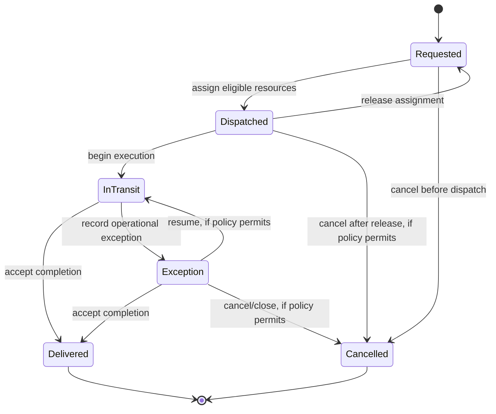

# Shipment lifecycle (proposed)

Shipment is the first recommended business capability. No lifecycle code exists yet.

## Identity and minimum data

- Identity: server-generated opaque `ShipmentId` (UUID is a reasonable database/API choice, subject to repository convention).
- Required facts: owning `CustomerId`, current status, creation time, and the pickup/delivery instructions required to execute the move. The exact shape of instructions is an open workflow decision; do not infer address, coordinates, cargo, price, or contact fields from the word “shipment.”
- Assignment and completion references/data are recorded only as the relevant workflow is implemented. Persistence representation is not an API contract.

The customer owns the request; operations staff control dispatch; the shipment aggregate owns legal shipment status changes. Access to the shipment is scoped to its customer or authorized operations role.

## State machine

`Exception` is a proposed nonterminal holding state, not an excuse to encode arbitrary statuses. Its permitted causes, resume behavior, and cancellation rules require operational policy. The narrow baseline can omit it until a real exception workflow is specified. In all cases, transitions are explicit methods/commands, not a writable status setter.

## Transition rules

| From → To | Rule / effect |
|---|---|
| create → Requested | Customer is valid/active and required execution instructions are present. |
| Requested → Dispatched | Only by successful dispatch assignment in the shared transaction; there is exactly one active assignment. |
| Dispatched → InTransit | Authorized operations workflow confirms execution start; the assignment must still be active. |
| Dispatched → Requested | Explicit release/cancel of assignment; resources become available atomically. |
| Dispatched → Cancelled | Only if cancellation policy permits; release the assignment and free both resources in the same transaction. |
| InTransit → Delivered | Authorized completion command passes the completion evidence required by policy; no active assignment remains or it is closed in the same transaction. |
| Requested → Cancelled | Authorized cancellation before assignment. |
| Delivered / Cancelled → any state | Illegal. Terminal states do not reopen; correction requires a separately audited business process, not mutation. |
| Any other unlisted transition | Illegal and returned as a domain conflict. |

The terminal states are Delivered and Cancelled. The transaction boundary for create/status transition is one Shipment aggregate transaction; assignment/release uses the explicit cross-root dispatch transaction above. A concurrent cancellation and assignment must serialize on the shipment row: one wins, the other observes the new state and conflicts. Optimistic versioning or row locks are viable; implementation must choose and test one. On transaction failure, no status/event/outcome is reported as committed.
